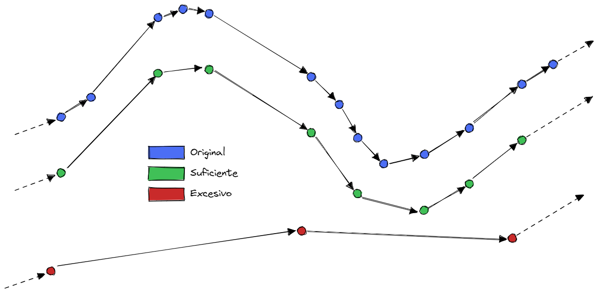
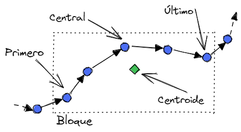

# Data_preparation notebook

En este cuaderno se realizan algunas modificaciones adicionales motivadas por el uso de redes LSTM. En particular, estas redes:
- Funcionan mejor cuando trabajan con datos regulares desde el punto de vista temporal; es decir, con intervalos de tiempo similares entre los sucesivos elementos.
- Trabajan sobre secuencias de datos, por lo que es necesario adaptar la entrada, generando los ejemplos individuales haciendo uso de una ventana deslizante para aprender a lo largo de toda la trayectoria. Para mejorar el rendimiento del entrenamiento, podemos generar estas ventanas y escribirlas en disco, de manera que no sea necesario construir al vuelo estas ventanas.

## Downsample
(Implementado en [[RTAutils.data_preparation]])

A pesar de que probablemente se genere de forma regular, la estrategia de asignación de timestamps seguida en ADS-B, junto con otros problemas inherentes a la tecnología (duplicación de datos, pérdida de cobertura, corrupción de los mensajes ADS-B...) contribuyen a que las secuencias de información de vigilancia puedan ser altamente irregulares en algunas partes de la trayectoria. Una técnica para reducir este problema es el *downsampling*, que consiste en reducir la densidad de vectores por unidad de tiempo.

Para ello, se toma un determinado período de muestreo, y se dividen los mensajes en bloques de esa misma longitud de tiempo. Para cada bloque, se toma un vector representativo, descartando los demás. De esta forma, los vectores en la nueva secuencia se encuentran (aproximadamente) equiespaciados. La elección del período de muestreo es un factor importante:
- Un período demasiado grande puede eliminar demasiada información, o hacer inviable la construcción de ventanas sobre las que hacer predicciones.
- Un período demasiado pequeño es más sensible a "huecos" en la trayectoria, ya que si hay un período de tiempo sin vectores superior al período de muestreo podría no haber ningún vector dentro del bloque correspondiente.

Como efecto colateral, el muestreo resume y por tanto "regulariza" la trayectoria, eliminando ruido y aproximándola al "caso general" al que podría asimilarse la trayectoria (además de que se reduce en gran medida el volumen de los datos, aligerando los procesos de entrenamiento de modelos). Hasta ahora, hemos observado que muestreos más agresivos conducen a un mejor rendimiento del modelo en la regresión.

>Selección del vector representativo del bucket
>Hay diferentes estrategias que podemos aplicar para seleccionar el vector representante de su bucket:
>- Tomar el primero/último/central: en todos los casos, es una selección arbitraria, y a priori ninguna presenta ninguna ventaja sobre las demás.
>- Cálculo del centroide y uso del vector más cercano: Utilizando una función de distancia, podemos detectar el vector más representativo del bloque; es decir, el más cercano ("parecido") al centroide del bucket.
>- Cálculo del centroide y uso del mismo como vector representativo: Sería la técnica que mejor resume la información real del bloque al completo, pero estaríamos trabajando con datos sintéticos.
> 

## Windowing
(Implementado en [[RTAutils.data_preparation]])

Este paso aborda tanto la generación de las secuencias de entrada. La implementación de las RNN en Keras requiere que se le proporcione secuencias de datos, indicando la longitud de dicha secuencia. Esta longitud se considera un hiperparámetro del modelo: cuanto más larga la secuencia de entrada, más información tendrá el modelo y de más largo alcance serán las dependencias temporales que pueda establecer, pero también se incrementa la complejidad del problema y el tiempo de entrenamiento de los modelos.

